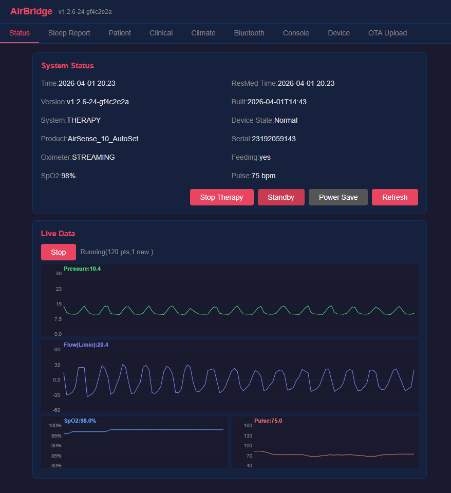
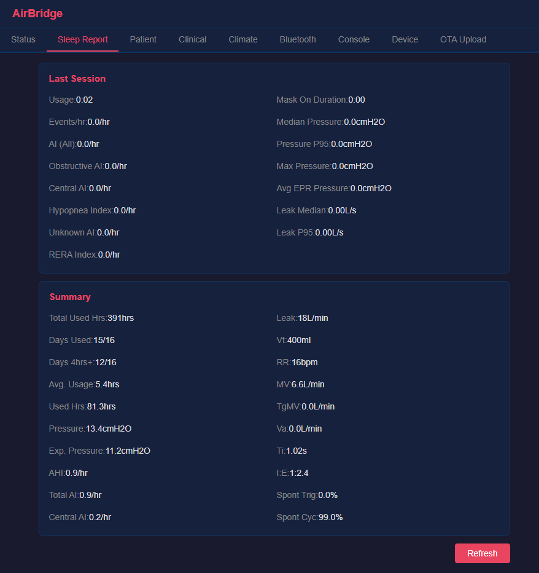
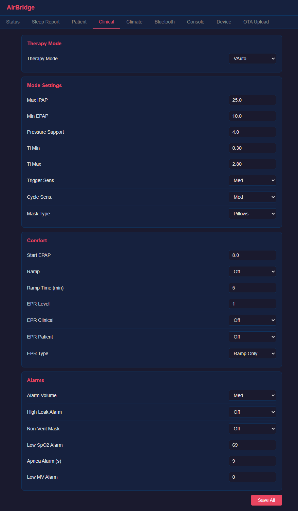
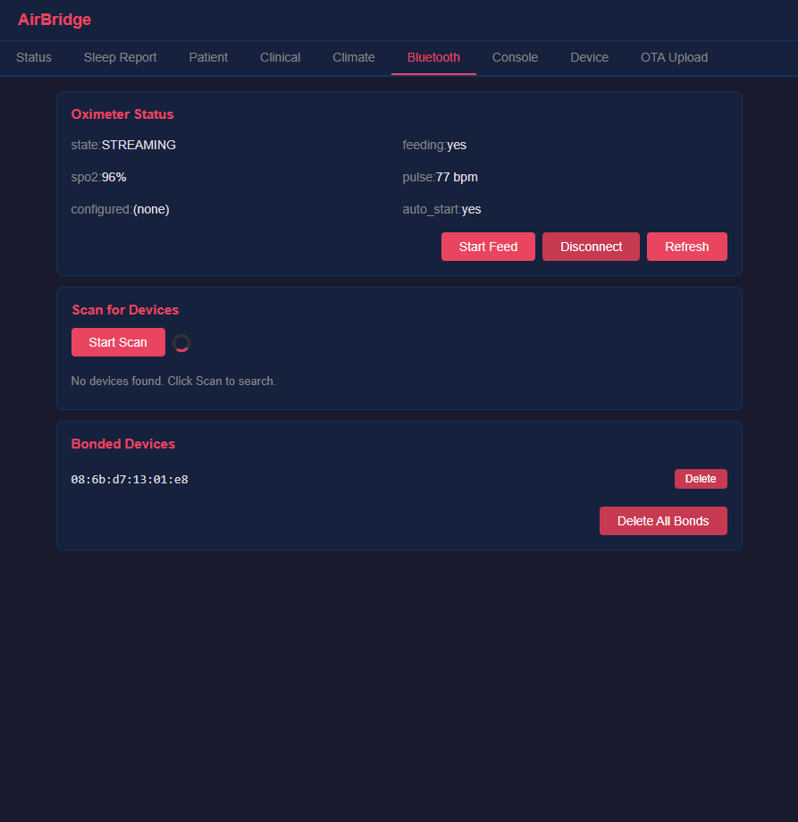
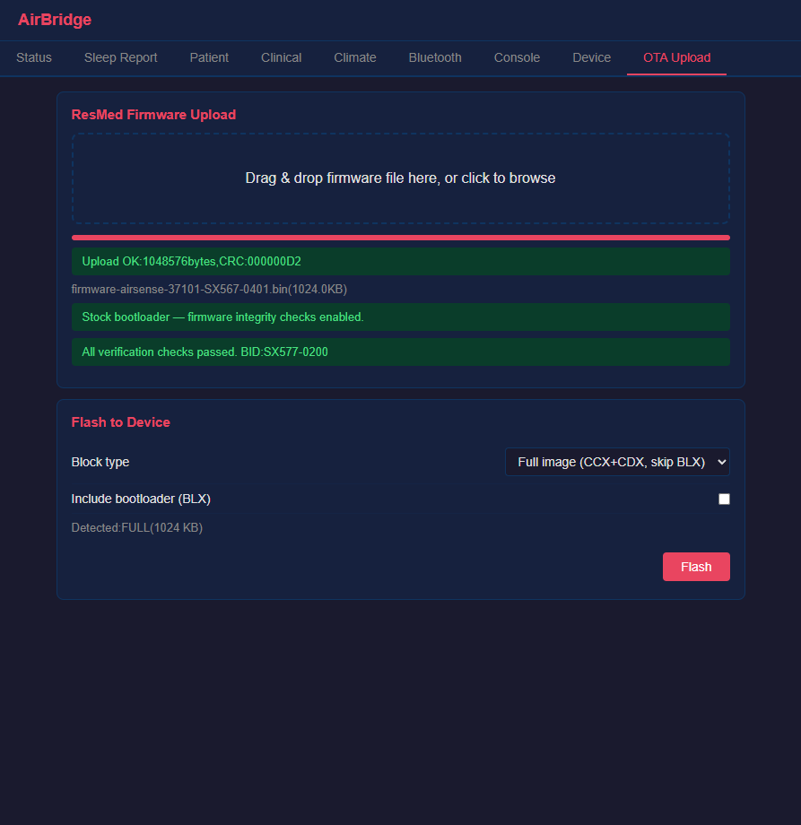

# AirBridge

ESP32 bridge for ResMed AirSense 10 CPAP.

## What it does

- **BLE oximetry** - feeds SpO2/pulse into AirSense at 1Hz for native SAD.edf recording. Tested with Nonin 3150. Should work with Wellue O2Ring, generic BLE PLX and HR sensors (untested).
- **Web UI** - read/write all therapy settings, live pressure/flow waveforms, BLE device management, ResMed firmware upload
- **TCP-UART bridge** - send commands to AirSense over WiFi. Single UART writer (arbiter) with priority queue prevents collisions between concurrent sources (TCP clients, BLE feeder, health monitor, web UI).
- **ResMed OTA** - flash AirSense firmware (BLX/CMX/CDX) over UART from web UI or CLI. Handles baud negotiation, block chaining, bootloader re-entry.

## First setup

1. Copy `provision.env.example` to `provision.env`, fill in your WiFi credentials
2. Flash: `pio run -t upload`
3. Open `http://airbridge/` (default login: admin/airbridge)

Without `provision.env`, the device tries SmartConfig for 60 seconds - use the [EspTouch](https://github.com/EspressifApp/EsptouchForAndroid/releases) app (v1 mode, phone must be on the target WiFi) to send credentials. If SmartConfig times out, it falls back to AP mode (`airbridge_XXXX`) where you can configure WiFi via web UI at `http://192.168.4.1/`.

## Related tools

[airbreak-plus](https://github.com/m-kozlowski/airbreak-plus/tree/master/python/) contains Python tools for direct serial/TCP interaction:

- `python/resmed_flash.py -p tcp:airbridge` - flash AirSense firmware
- `python/resmed_config.py -p tcp:airbridge` - read/write AirSense settings

Both support serial (`-p /dev/ttyUSB0`) and TCP (`-p tcp:hostname`) with `--tcp-mode=raw|transparent|text`.

## Screenshots

| Status & live waveforms | Sleep report | Therapy settings | BLE management | Firmware upload |
|---|---|---|---|---|
|  |  |  |  |  |

## License

GPL v3. See [LICENSE](LICENSE).
